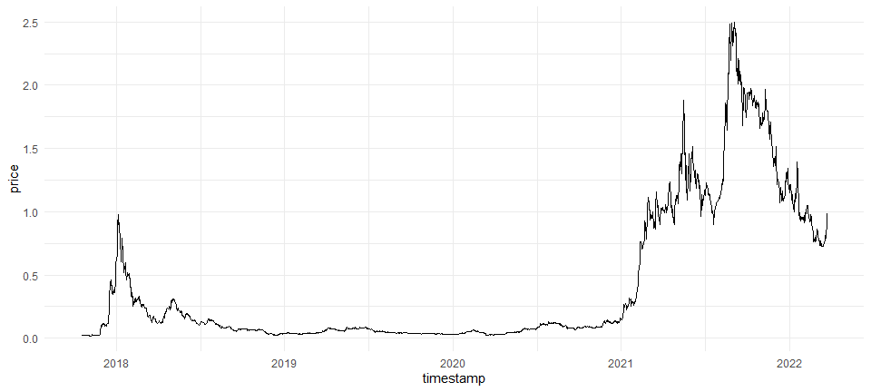

<!-- README.md is generated from README.Rmd. Please edit that file -->

# geckor 

<!-- badges: start -->

[](https://github.com/next-game-solutions/geckor/actions)
[](https://codecov.io/gh/next-game-solutions/geckor?branch=main)
[](https://lifecycle.r-lib.org/articles/stages.html#stable)
[](https://cran.r-project.org/package=geckor)

<!-- badges: end -->

`geckor` is an R client for the public [CoinGecko
API](https://www.coingecko.com/en/api#explore-api). This package
implements several endpoints offered by that API, allowing users to
collect the current and historical market data on thousands of
cryptocurrencies from more than 300 exchanges. Results are returned in a
tabular form (as [tibbles](https://tibble.tidyverse.org/)), ready for
any downstream analyses.

This version of the package has minor changes coming from Pietro,
tayloring the package to his needs.

## Installation

A stable version of this package can be installed from
[CRAN](https://cran.r-project.org/web/packages/geckor/index.html) the
usual way:

``` r
install.packages("geckor")
```

To install the development version from GitHub, use the following
command(s):

``` r
# install.packages("devtools")
devtools::install_github("pietroreggiani/geckor")
```

## Examples

Detailed examples of how to use `geckor` can be found in its [online
documentation](https://next-game-solutions.github.io/geckor/). Provided
below are just a few common queries:

``` r
library(geckor)
#> R client for the CoinGecko API
#> Developed by Next Game Solutions (http://nextgamesolutions.com)

# check if the CoinGecko service is available:
ping()
#> [1] TRUE
```

``` r
library(dplyr)
library(ggplot2)

# Get the current price of Cardano, Tron, and Polkadot,
# expressed in USD, EUR, and GBP:
current_price(coin_ids = c("cardano", "tron", "polkadot"),
              vs_currencies = c("usd", "eur", "gbp"))
#> # A tibble: 9 x 7
#>   coin_id    price vs_currency   market_cap     vol_24h price_percent_change_24h
#>   <chr>      <dbl> <chr>              <dbl>       <dbl>                    <dbl>
#> 1 cardano   1.07   usd         34395713999. 2391874881.                    10.6 
#> 2 cardano   0.973  eur         31242590105. 2172831763.                    10.7 
#> 3 cardano   0.811  gbp         26033875156. 1810728217.                    11.0 
#> 4 polkadot 20.6    usd         22575036986.  940548272.                     3.54
#> 5 polkadot 18.7    eur         20507479649.  854414742.                     3.69
#> 6 polkadot 15.6    gbp         17091289602.  712026080.                     3.91
#> 7 tron      0.0642 usd          6524891452.  690572942.                     1.85
#> 8 tron      0.0583 eur          5926741603.  627331653.                     1.99
#> 9 tron      0.0486 gbp          4938644666.  522786506.                     2.22
#> # ... with 1 more variable: last_updated_at <dttm>

# Get a more comprehensive view of the current Cardano, Tron, and 
# Polkadot markets:
current_market(coin_ids = c("cardano", "tron", "polkadot"), 
               vs_currency = "usd") %>% 
  glimpse()
#> Rows: 3
#> Columns: 32
#> $ coin_id                                  <chr> "cardano", "polkadot", "tron"
#> $ symbol                                   <chr> "ada", "dot", "trx"
#> $ name                                     <chr> "Cardano", "Polkadot", "TRON"
#> $ vs_currency                              <chr> "usd", "usd", "usd"
#> $ last_updated_at                          <dttm> 2022-03-23 18:36:02, 2022-03-~
#> $ current_price                            <dbl> 1.071000, 20.630000, 0.064183
#> $ market_cap                               <dbl> 34395713999, 22575036986, 652~
#> $ market_cap_rank                          <int> 8, 11, 26
#> $ fully_diluted_valuation                  <dbl> 48268829067, NA, NA
#> $ total_volume                             <dbl> 2391874881, 940548272, 690572~
#> $ high_24h                                 <dbl> 1.095000, 20.910000, 0.064834
#> $ low_24h                                  <dbl> 0.960539, 19.880000, 0.062909
#> $ price_change_24h                         <dbl> 0.10254800, 0.70554300, 0.001~
#> $ price_change_percentage_24h              <dbl> 10.58551, 3.54180, 1.85250
#> $ market_cap_change_24h                    <dbl> 3325734561, 711417992, 11292~
#> $ market_cap_change_percentage_24h         <dbl> 10.70401, 3.25389, 1.76120
#> $ circulating_supply                       <dbl> 32066390668, 1096154233, 1017~
#> $ total_supply                             <dbl> 45000000000, 1177103366, 1019~
#> $ max_supply                               <dbl> 4.5e+10, NA, NA
#> $ ath                                      <dbl> 3.090000, 54.980000, 0.231673
#> $ ath_change_percentage                    <dbl> -65.25342, -62.60959, -72.343~
#> $ ath_date                                 <dttm> 2021-09-02 06:00:10, 2021-11-~
#> $ atl                                      <dbl> 0.01925275, 2.70000000, 0.001~
#> $ atl_change_percentage                    <dbl> 5471.1330, 662.1103, 3451.0446
#> $ atl_date                                 <dttm> 2020-03-13 02:22:55, 2020-08-~
#> $ price_change_percentage_1h_in_currency   <dbl> -0.88331926, -0.07439986, -0.~
#> $ price_change_percentage_24h_in_currency  <dbl> 10.585505, 3.541804, 1.852499
#> $ price_change_percentage_7d_in_currency   <dbl> 33.84523, 15.69328, 6.04064
#> $ price_change_percentage_14d_in_currency  <dbl> 33.59387, 21.72065, 5.99865
#> $ price_change_percentage_30d_in_currency  <dbl> 14.68462, 21.69888, 3.02252
#> $ price_change_percentage_200d_in_currency <dbl> -63.89347, -38.30276, -36.749~
#> $ price_change_percentage_1y_in_currency   <dbl> -3.213772, -41.928038, 7.4474~

# Collect all historical data on the price of Cardano (expressed in EUR),
# and plot the result:
cardano_history <- coin_history(coin_id = "cardano", 
                                vs_currency = "eur", 
                                days = "max")

cardano_history %>% 
  ggplot(aes(timestamp, price)) +
  geom_line() + theme_minimal()
```



``` r
# As of v0.2.0, all `coin_history_*()` functions can retrieve 
# data for multiple coins (up to 30) in one call, e.g.:
two_coins <- coin_history(coin_id = c("cardano", "polkadot"), 
                          vs_currency = "usd", 
                          days = 3)
two_coins$coin_id %>% unique()
#> [1] "cardano"  "polkadot"
```

## API rate limit

The public [CoinGecko
API](https://www.coingecko.com/api/documentations/v3) offers a rate
limit of 50 calls per minute. Please keep this limit in mind when
developing your applications using the `geckor` package.

## Getting help

If you encounter a clear bug, please file an issue with a minimal
reproducible example on
[GitHub](https://github.com/next-game-solutions/geckor/issues).

## Licensing

This package is licensed to you under the terms of the MIT License.

The gecko silhouette image used in the hexagon logo of this package has
been downloaded from
[Clipartkey.com](https://www.clipartkey.com/view/hmTimm_geckos-png-transparent-gecko-icon-transparent/)
and is believed to be in the public domain. The logo has been created
using the [hexmake app](https://connect.thinkr.fr/hexmake/).

Copyright © 2022 [Next Game Solutions OÜ](http://nextgamesolutions.com)

------------------------------------------------------------------------

Please note that this project is released with a [Contributor Code of
Conduct](https://www.contributor-covenant.org/version/1/0/0/code-of-conduct/).
By participating in this project you agree to abide by its terms.
